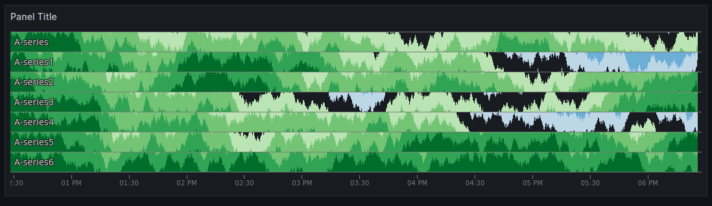

# A cubism panel for Grafana

This plugin allows to use [cubism.js](https://square.github.io/cubism/) in Grafana.

For instance this 

## Installation

For a detailed guide on how to install and configure the plugin,
see the [Grafana plugin installation documentation](https://grafana.com/docs/grafana/latest/administration/plugin-management/).

The quckstart is to use the `grafana cli` to install the plugin from the Rockset public S3 bucket:
```
grafana cli \
  --pluginUrl https://github.com/ekacnet/cubismgrafana-panel/releases/download/v0.0.1/cubismgrafana-panel-0.0.1.zip \
  plugins install cubismgrafana-panel
```

## Developing / Contributing

1. Install dependencies

   ```bash
   npm install
   ```

2. Build plugin in development mode and run in watch mode

   ```bash
   npm run dev
   ```

3. Start the Grafana server

   ```bash
   docker-compose up -d
   ```

## Helping me

PR and issues are welcome, you can also [buy me some coffee](https://www.buymeacoffee.com/matthieup) it's always a good idea to keep caffinated.
